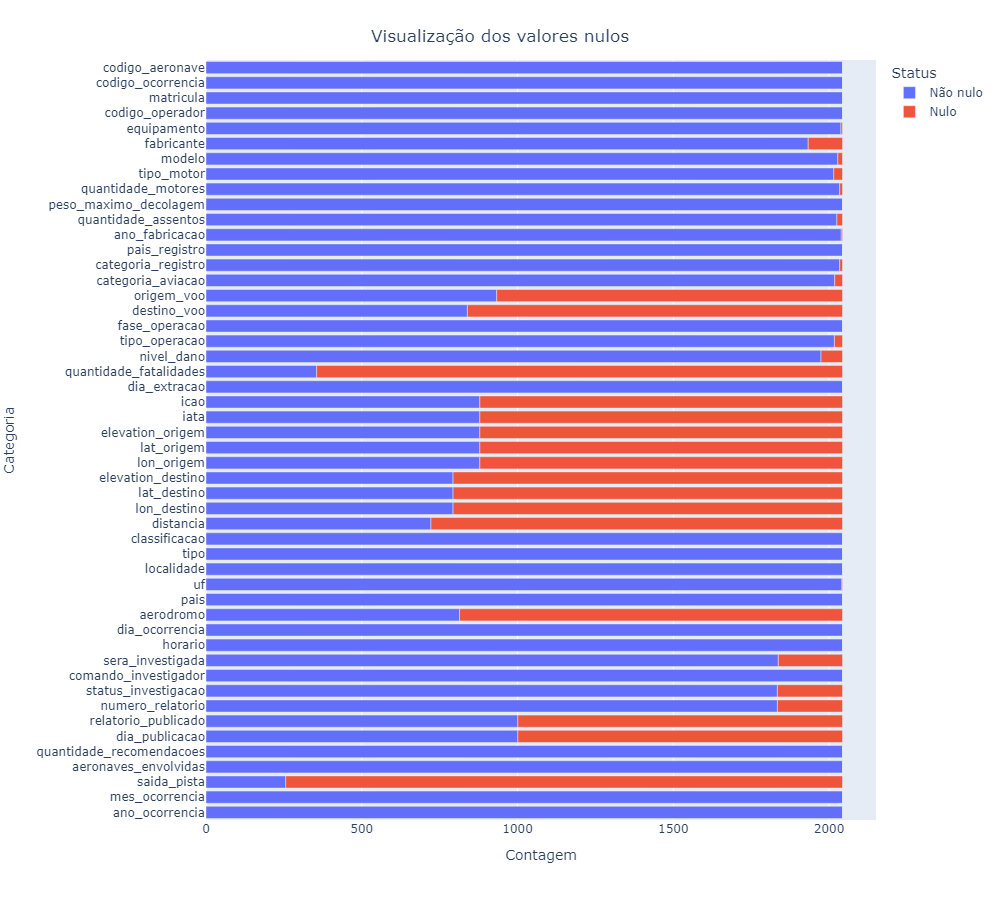
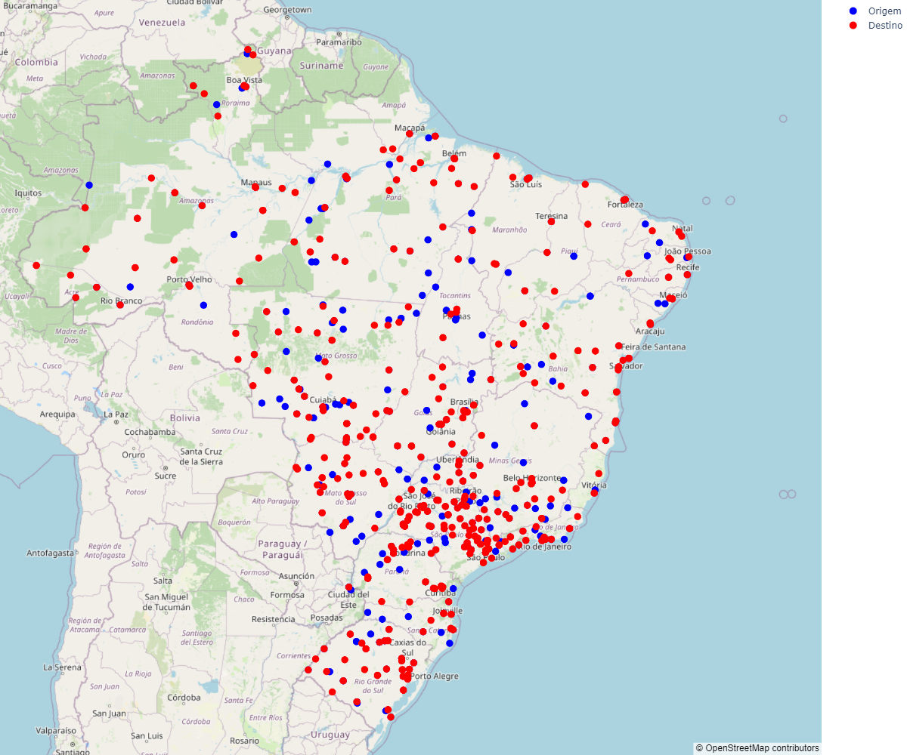

# ocorrencias_aeronauticas

Este repositório armazena a análise de dados sobre as Ocorrências Aeronáuticas na Aviação Civil Brasileira. Os dados foram fornecidos pela CENIPA.

As bibliotecas para executar o notebook em ambiente virtual ou algum outro local, estão contidos no arquivo requirements.txt
 
 
Valore nulos da base de dados
 

 
Localização dos aeroportos de destino e origem 
 

 
Nuvem de palavras dos tipos de falhas
 

# Conclusões

**Inconsistências:**
 Existe aeronaves de pequeno e grande porte que constam como não possuírem assentos. Ao pesquisar alguns desses modelos na internet, comprovou-se que isso não é verdade.

**Constatações:**
 As 3 principais causas de acidente somadas chegam a praticamente 50% dos incidentes.
 Ao longo dos anos a quantidade de viagens de avião cresceu e por consequência os desastres.
 O mês de junho possui queda nas viagens segundo informações coletadas e isso se refletiu no gráfico de séries temporais dos incidentes.
 A distribuição de acidentes considerando os locais de destino e origem dos voos, não demonstraram nenhuma alta concentração em local específico no mapa.

**Resumo das hipóteses:**
 - Primeira hipótese: Existe associação entre categoria e a classificação do acidente. (CONFIRMADA)

 - Segunda hipótese: Existe associação entre o ano de fabricação e a classificação do acidente. (REJEITADA)

 - Terceira hipótese: Existe associação entre o tipo de operação e o tipo de dano. (CONFIRMADA)

 - Quarta hipótese: Existe associação entre o tipo de operação e o nível de dano. (CONFIRMADA)

 - Quinta hipótese: Existe associação entre o fabricante e o nível de dano. (CONFIRMADA)

 - Sexta hipótese: Existe associação entre o fabricante e a classificação do acidente. (CONFIRMADA)

Mesmo as variáveis tendo apresentado baixa correlação de Pearson ou Spearman, elas ainda podem apresentar 
associação significativa de acordo com o teste do qui-quadrado. Isso ocorre porque o teste do qui-quadrado leva em consideração a frequência de ocorrência conjunta das variáveis em questão, enquanto a correlação de Pearson ou Spearman avalia apenas a relação linear e não-linear entre elas.
Informações relacionadas a manutenção das aeronaves e sobre os voos que não sofreram acidente poderiam contribuir para enriquecer a análise dos dados.

